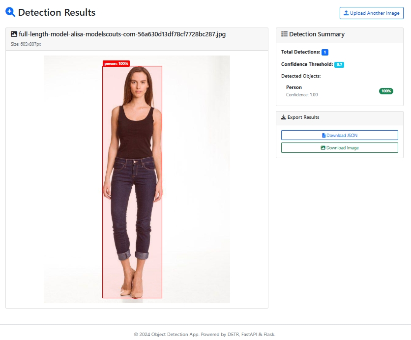

# 🎯 AI Object Detection Web App

<div align="center">



*🎨 Modern web interface with drag-and-drop functionality and real-time object detection*

[](https://python.org)
[](https://fastapi.tiangolo.com)
[](https://flask.palletsprojects.com)
[](LICENSE)
[](CONTRIBUTING.md)

*A modern, production-ready web application for AI-powered object detection using Facebook's DETR model*

[📸 Dashboard](#dashboard-preview) • [🛠️ Installation](#installation) • [🚀 Quick Start](#quick-start) • [📖 Documentation](#documentation) • [🤝 Contributing](#contributing)

</div>

---

## ✨ Features

🔍 **Advanced AI Detection** - Powered by Facebook's DETR (Detection Transformer) ResNet-50 model  
🌐 **Modern Web Interface** - Responsive UI with drag-and-drop functionality  
⚡ **Real-time Processing** - Instant object detection with confidence scores  
📊 **Batch Processing** - Handle multiple images simultaneously  
🎨 **Interactive Visualization** - Dynamic bounding boxes with object labels  
📁 **Export Capabilities** - Download results in JSON/CSV formats  
🚀 **RESTful API** - Complete API with auto-generated documentation  
💾 **Smart Caching** - Local model storage for faster subsequent runs  

## 🏗️ Architecture

```
├── 🖥️  backend/           # FastAPI REST API
│   └── main.py           # ML inference endpoints
├── 🎨 frontend/          # Flask web application  
│   ├── app.py           # Web interface logic
│   └── templates/       # Responsive HTML templates
├── 📁 assets/           # Demo images and screenshots
├── 🔧 scripts/          # Utility and setup scripts
└── 📚 docs/             # Additional documentation
```

## 📋 Requirements

- Python 3.8+
- CUDA-compatible GPU (optional, for faster inference)
- 4GB+ RAM
- Internet connection (for initial model download)

## 🛠️ Installation

### Quick Setup
```bash
# Clone the repository
git clone https://github.com/your-username/Object-Detection.git
cd Object-Detection

# Run automated setup
python scripts/setup.py
```

### Manual Setup
```bash
# Create virtual environment
python -m venv venv

# Activate virtual environment
# Windows:
venv\Scripts\activate
# Linux/Mac:
source venv/bin/activate

# Install dependencies
pip install -r requirements.txt

# Download AI models (optional - auto-downloads on first use)
python scripts/download_models.py
```

## 🚀 Quick Start

### Using Startup Scripts (Recommended)

```bash
# Terminal 1: Start Backend
python scripts/start_backend.py

# Terminal 2: Start Frontend  
python scripts/start_frontend.py

# Open browser: http://localhost:5000
```

### Manual Start

```bash
# Terminal 1: Backend
cd backend && python main.py

# Terminal 2: Frontend
cd frontend && python app.py
```

### Docker Deployment

```bash
# Build and run with Docker Compose
docker-compose up --build

# Access at http://localhost:5000
```

## 📸 Dashboard Preview

<div align="center">

### 🎨 Modern Web Interface

The application features a clean, responsive dashboard with:
- **Drag & Drop Upload**: Simply drag images or click to browse
- **Real-time Processing**: Instant object detection with progress indicators  
- **Interactive Results**: Bounding boxes with confidence scores
- **Batch Processing**: Handle multiple images simultaneously
- **Export Options**: Download results in JSON/CSV formats


*The dashboard automatically detects objects and displays them with labeled bounding boxes and confidence percentages*

</div>

## 🎯 Usage

### Web Interface

1. **Upload Single Image**
   - Drag and drop an image or click to browse
   - Adjust confidence threshold (0.1 - 1.0)
   - Click "Detect Objects"

2. **Batch Processing**
   - Select multiple images
   - Set confidence threshold
   - Click "Batch Detect"

3. **View Results**
   - Interactive bounding boxes on images
   - Object class names and confidence scores
   - Export results as JSON or CSV

### API Usage

The FastAPI backend provides RESTful endpoints:

- `GET /` - Health check
- `GET /health` - Detailed health status
- `POST /detect` - Single image detection
- `POST /detect-batch` - Batch image detection

**API Documentation**: http://localhost:8000/docs

### Example API Request

```python
import requests

# Single image detection
with open('image.jpg', 'rb') as f:
    files = {'file': f}
    data = {'confidence_threshold': 0.7}
    response = requests.post('http://localhost:8000/detect', files=files, data=data)
    result = response.json()
```

## 🔧 Configuration

### Backend Configuration (backend/main.py)
- `BACKEND_URL`: API server URL (default: http://localhost:8000)
- `cache_dir`: Model cache directory (default: ./models)

### Frontend Configuration (frontend/app.py)
- `BACKEND_URL`: Backend API URL (default: http://localhost:8000)
- `UPLOAD_FOLDER`: File upload directory (default: uploads)
- `ALLOWED_EXTENSIONS`: Allowed file types

## 📊 Supported Image Formats

- PNG, JPG, JPEG, GIF, BMP, WEBP

## 🎨 Object Classes

The DETR model can detect 91 different object classes from the COCO dataset, including:
- People, animals (person, cat, dog, horse, etc.)
- Vehicles (car, truck, bicycle, motorcycle, etc.)
- Household items (chair, table, tv, laptop, etc.)
- Food items (apple, banana, pizza, etc.)

## 🚨 Troubleshooting

### Common Issues

1. **Backend Offline Error**
   - Ensure FastAPI backend is running on port 8000
   - Check if port is already in use

2. **Model Loading Errors**
   - Run `pip install timm` if missing
   - Ensure stable internet connection for initial download
   - Check available disk space (models ~200MB)

3. **Memory Issues**
   - Close other applications to free RAM
   - Use smaller images or reduce batch size

4. **Slow Performance**
   - Install CUDA-compatible PyTorch for GPU acceleration
   - Use local model cache (run download_models.py)

### Port Conflicts

If default ports are in use:

**Backend (port 8000):**
```bash
uvicorn main:app --host 0.0.0.0 --port 8001
```

**Frontend (port 5000):**
```python
# In frontend/app.py, change:
app.run(debug=True, host='0.0.0.0', port=5001)
```

## 🔒 Security Notes

- This is a development setup - not production-ready
- Change Flask secret key in production
- Implement proper authentication for production use
- Validate and sanitize file uploads
- Use HTTPS in production

## 📈 Performance Tips

1. **GPU Acceleration**: Install CUDA-compatible PyTorch
2. **Model Caching**: Run `download_models.py` once
3. **Batch Processing**: Process multiple images together
4. **Image Optimization**: Resize large images before upload

## 🤝 Contributing

1. Fork the repository
2. Create a feature branch
3. Make your changes
4. Test thoroughly
5. Submit a pull request

## 📄 License

This project is open source. Please check individual model licenses:
- DETR model: Apache 2.0 License
- Dependencies: Various licenses (see requirements.txt)

## 🙏 Acknowledgments

- Facebook AI Research for the DETR model
- Hugging Face for the Transformers library
- FastAPI and Flask communities

## 📞 Support

For issues and questions:
1. Check the troubleshooting section
2. Review API documentation at http://localhost:8000/docs
3. Check console logs for error messages

## 🤝 Contributing

We welcome contributions! Please see our [Contributing Guide](CONTRIBUTING.md) for details.

1. Fork the repository
2. Create a feature branch (`git checkout -b feature/amazing-feature`)
3. Commit your changes (`git commit -m 'Add amazing feature'`)
4. Push to the branch (`git push origin feature/amazing-feature`)
5. Open a Pull Request

## 📄 License

This project is licensed under the MIT License - see the [LICENSE](LICENSE) file for details.

## 🙏 Acknowledgments

- [Facebook AI Research](https://ai.facebook.com/) for the DETR model
- [Hugging Face](https://huggingface.co/) for the Transformers library
- [FastAPI](https://fastapi.tiangolo.com/) and [Flask](https://flask.palletsprojects.com/) communities
- All contributors who help improve this project
